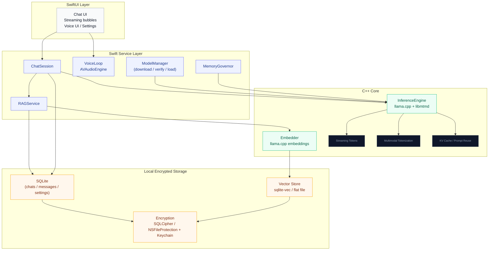

# SynapLink

A fully offline, on-device multimodal chatbot for iOS. SwiftUI frontend, C++
inference core (llama.cpp + libmtmd), single omni model (audio + vision + text
input), streamed output, RAG, encrypted local chat history. No network calls
for inference — ever.

Baseline device: **iPhone 11 (A13, 4 GB RAM)**. 

## Architecture



## Layout

- `SynapLink/` — app sources (SwiftUI + Swift service layer + C/C++ engine)
- `scripts/build-frameworks.sh` — builds all three native xcframeworks (run this first)
- `scripts/build-{llama,whisper,sd}-xcframework.sh` — individual framework builds
  (llama.cpp + libmtmd, whisper.cpp ASR, stable-diffusion.cpp image-gen)
- `scripts/test-{engine,whisper,sd}-macos.sh` — desktop functional tests of the bridges
- `docs/PHASE_0.md` — scaffolding & inference core: build + smoke-test instructions
- `docs/PHASE_1.md` — text chat MVP: architecture, model catalog, chat pipeline
- `docs/PHASE_2.md` — multimodal input: attachments, capture, media validation
- `docs/PHASE_3.md` — sidecar specialists: whisper ASR, SmolVLM vision, SD image-gen

## Quick start

The `*.xcframework`s under `Frameworks/` are **gitignored build artifacts** —
you must build them before opening Xcode, or the build fails with
"There is no XCFramework found at …". One command does it (≈40–60 min first run;
each is skipped if already present):

```sh
git submodule update --init        # llama.cpp, whisper.cpp, stable-diffusion.cpp
scripts/build-frameworks.sh        # → Frameworks/{llama,whisper,sd}.xcframework
open SynapLink.xcodeproj
```

See `docs/PHASE_0.md` for the on-device smoke test (exit gate: ≥7 tok/s,
peak footprint <1.8 GB on iPhone 11).
